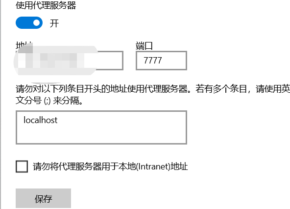
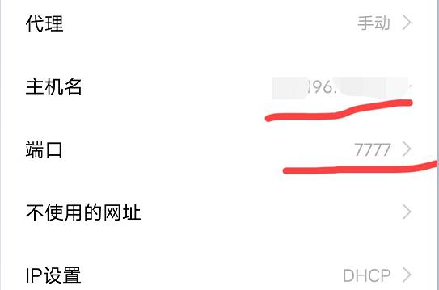
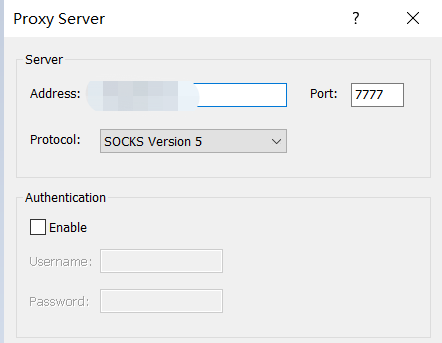

## GoOut

这是一个可以将Tcp流量伪装成Http流量的程序,并可以提供HTTP代理端口和Sock5代理端口

## 用法

### GoOut服务端

```
git clone https://github.com/blacknight2018/GoOut
cd GoOut/cmd/server
go build main.go
```

```
./main
```

### GoOut客户端

```
git clone https://github.com/blacknight2018/GoOut
cd GoOut/cmd/client
go build main.go
```

```
./main -h
```

```
Usage of main.exe:
  -http
        使用Http代理协议,默认false,即默认使用Sock5代理协议
  -server string
        GoOut服务端地址 (default "127.0.0.1:80")
  -time int
        TCP连接超时时间(分钟) (default 1)
```

> Http代理模式和Sock5代理模式默认端口都是7777

##### Http代理模式

```
main.exe -server=xxx.xxx.xxx.xxx:80  -http
```

##### Sock5代理模式

```
main.exe -server=xxx.xxx.xxx.xxx:80
```

### 在你的操作系统上使用GoOut客户端

> 图中打码地址即为你的GoOut客户端所在地址

###### 在Win10上使用GoOut客户端 (GoOut使用Http代理模式)



###### 在Android系统上使用GoOut客户端 (GoOut使用Http代理模式)



###### 在Win10上使用Proxifier (GoOut使用Sock5代理模式)

